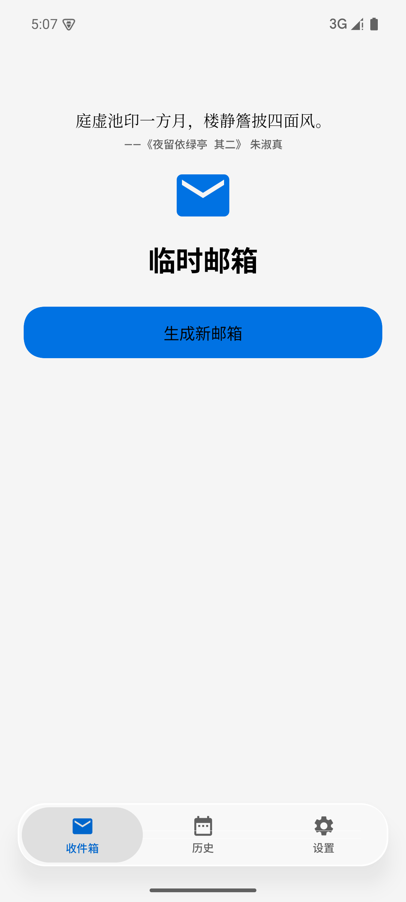
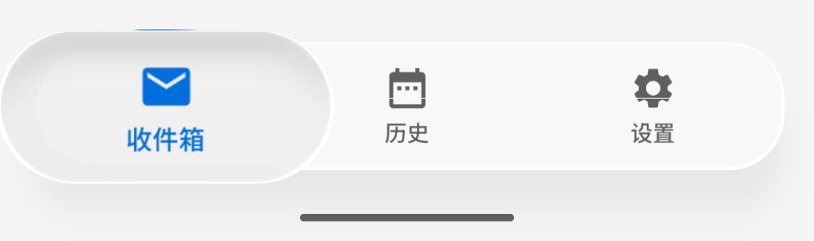
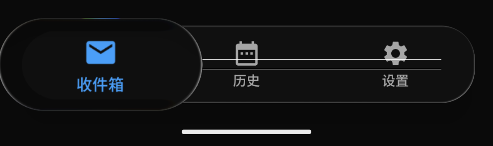
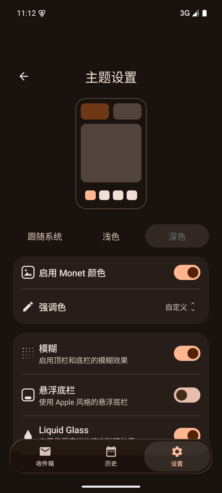

# TempMail-UI

> **tempmail 应用的 UI 实现**（独立仓库）：双主题体系（Material3 / HyperOS·Miuix 桥接）、
> 莫奈取色（动态配色）、液态玻璃底栏三形态，以及「主题设置」等界面代码。
> 工程自带可运行的演示 App，克隆下来就能看到全部效果。

[](LICENSE)
[](https://developer.android.com)
[](https://kotlinlang.org)
[](https://developer.android.com/jetpack/compose)
[](https://github.com/compose-miuix-ui/miuix)

- 仓库结构：`:tempmailui`（UI 实现库）+ `:app`（可运行的演示 App）
- 相关仓库：[tempmail](https://github.com/wzhdgithub/tempmail)（应用本体）·
  [LiquidGlassBar](https://github.com/wzhdgithub/LiquidGlassBar)（从本仓库抽出的液态玻璃底栏通用库）

---

## Preview

演示 App 实机截图（Android 15 / API 35，1080×2400）：

| 浅色 · 内容穿过玻璃底栏 | 深色 · 内容穿过玻璃底栏 |
|---|---|
|  |  |

| 浅色 · 按下（放大镜） | 深色 · 按下（放大镜） |
|---|---|
|  |  |

> 右侧两张为底栏区域的裁剪图：按下 = 放大镜（胶囊放大约 1.39×、折射并放大其下方图标、带轻微色散）。

| 主题设置 · 浅色 + 莫奈取色 | 主题设置 · 深色 + 莫奈取色 |
|---|---|
|  |  |

> Miuix 主题下的「主题设置」页：手机预览示意图 / 明暗三选一 / 莫奈取色 + 强调色 / 底栏三形态开关。
> 完整实现说明（含实测数据）见 [docs/monet-theme.md](docs/monet-theme.md)。

---

## 内容结构

| 文件 | 行数 | 职责 |
|---|---:|---|
| `tempmailui/.../theme/Theme.kt` | 282 | `TempMailTheme`：两套主题装配 + 逐 token 颜色过渡（240ms）、`ThemeStyle`/`ThemeMode` 分支 |
| `tempmailui/.../theme/Color.kt` | 46 | 调色常量、`ThemeStyle`（Material3 / HyperOS）、`ThemeMode`（跟随系统 / 浅色 / 深色，带 `fromKey` 回退） |
| `tempmailui/.../theme/Type.kt` | 13 | `Typography`（两套主题共用的字体层级） |
| `tempmailui/.../theme/MiuixComponents.kt` | 666 | **Miuix 桥接层**：`MiuixThemeIfNeeded`、`hyperMiuixColors` / `dynamicMiuixColors` / `animateMiuixColors`、`Themed*` 组件族、`themedSurfaceColors` / `themedBarContainerColor` / `cornerRadiusOf` |
| `tempmailui/.../theme/dynamic/DynamicColorSchemes.kt` | 148 | seed → 完整 Material 3 双套配色（MCU，纯函数）、`DynamicStyle`、`NoDynamicSeed` |
| `tempmailui/.../theme/dynamic/SeedExtractor.kt` | 56 | 图片 → 种子色（降采样解码 + `androidx.palette`，跑在 `Dispatchers.IO`） |
| `tempmailui/.../theme/dynamic/MonetPresets.kt` | 22 | 内置预设强调色 + `DefaultMonetSeed` |
| `tempmailui/.../glass/GlassBottomBar.kt` | 1047 | `GlassShell` / `GlassBar` / `GlassBarTabItem`、公开 API（`GlassBarItem` / `GlassBarSpace` / `isGlassBlurSupported`）、手感常量、`CombinedBackdrop`、重力高光、`vibrancy()` / `lens()` 与两套 AGSL 着色器 |
| `tempmailui/.../glass/GlassInteraction.kt` | 348 | `DampedDragAnimation`（value / velocity / pressProgress / dragFlow）、`InteractiveHighlight`（按压光斑）、手势工具 |
| `tempmailui/.../glass/InnerShadow.kt` | 163 | `InnerShadow` + `Modifier.innerShadow`（胶囊内阴影，不依赖 API 级 widget） |
| `app/.../demo/MainActivity.kt` | 1278 | 演示 App：主题设置页、预览示意图、强调色下拉、三形态底栏、手绘图标、示意列表 |

---

## 特性

### 主题系统（Material3 / HyperOS 双轨）

- **同一份页面代码跑两套主题**：`ThemeStyle.Material3` 走水波纹 Material 3 组件，`ThemeStyle.HyperOS` 叠加 Miuix
  （KernelSU 同款 HyperOS 风格组件），页面无需感知
- **桥接层而非分叉**：组件统一经 `Themed*` 封装（`ThemedCard` / `ThemedSwitch` / `ThemedButton` / `ThemedTextButton` /
  `ThemedIconButton` / `ThemedDivider` / `ThemedLinearProgress` / `ThemedSegmentedTabs` / `ThemedListRow` / `ThemedDropdownValue`），
  Material3 模式保持原样，HyperOS 模式才渲染 Miuix 组件
- **颜色过渡**：主题切换（明暗 / 风格 / 种子色）时，Material 3 与 Miuix 的每个颜色 token 分别做 240ms 插值，
  两套主题同一节奏、不出现「半边先变色」
- **形状与容器色同源**：`themedSurfaceColors()` / `themedBarContainerColor()` 让自绘组件（预览示意图、伪玻璃底栏）
  取到与真实组件完全一致的配色

### 莫奈取色（Monet 动态配色）

- **一条链路两端复用**：图片 → `androidx.palette` 提取种子色 → MCU（`material-color-utilities`）推导出完整
  Material 3 双套 `ColorScheme`；Miuix 侧再由 `dynamicMiuixColors` 逐 token 映射，两套主题共用同一颗种子
- **4 种配色风格**（TonalSpot / Vibrant / Expressive / Content）+ **2 档对比度**（默认 / 高）
- **只持久化一个 Int**：配色是种子的纯函数，重启后无需保存图片或重算
- **HyperOS 层级规则**：浅色下页面取 `surfaceContainerLow`、卡片取 `surfaceContainer`；深色下页面取
  `surfaceContainerLowest`、卡片亮一档 —— 保证卡片与页面「相差一档」且都带种子色的色调
- **默认关闭**：未启用时传 `dynamicSeed = null`，两套主题与原配色逐像素一致

### 液态玻璃底栏

- **真实背景模糊**：底栏采样其下方内容（`LayerBackdrop`）做 4dp 模糊 + 饱和度增强（vibrancy 1.5），不是半透明色块
- **边缘折射（Lens）**：AGSL 圆角矩形 SDF，把玻璃边缘的采样坐标向外偏移，形成「厚玻璃」的透镜折射
- **色散**：选中胶囊按住时带 chromatic aberration（0.5），边缘出现隐约红/蓝色边
- **按压放大镜**：按住（或拖动）时选中胶囊放大到 1.39×（78/56），并折射放大其下方被染成主色的图标
- **按住拖动切换 Tab**：按住底栏左右拖动即可切换，拖动时玻璃厚度 / 拉伸随速度与幅度「流动」
- **惯性吸附**：松手按「位置 + 速度 × 0.22s」预测目标 Tab，快速甩动即使没拖过中点也能切到相邻 Tab
- **越界橡皮筋**：拖出两端时整条底栏最多位移 4dp；Tab 区间内拖动底栏本体不位移
- **重力高光**：1dp BloomStroke 镜面高光，光源方向随重力按 3° 量化旋转，静止时朝上
- **胶囊内阴影**：不依赖 API 级 widget 的 `Modifier.innerShadow`（GraphicsLayer + BlurEffect + Clear 遮罩）
- **能力探测与降级**：`isGlassBlurSupported()`（API ≥ 33 + `isRuntimeShaderSupported()` + AGSL 探针）不可用时，
  `GlassShell` 直接改用调用方传入的普通底栏
- **低开销**：动画值只在 `effects` / `layerBlock` / draw 阶段读取（不触发重组）；模糊半径为常量，避免每帧重建 RenderEffect 链

### 界面与过渡

- **主题设置页**：手机预览示意图 + 明暗三选一 + 莫奈取色（含强调色下拉）+ 底栏三形态开关，改动实时生效
- **预览示意图**：配色取自 `themedSurfaceColors()`、圆角取自当前主题的 shapes token、底栏形态随开关在
  「悬浮（内缩 + 圆角 + 抬离底边）↔ 贴边（满宽 + 直角 + 紧贴底边）」之间平滑形变
- **强调色下拉**：`Popup` 锚定在「强调色」行下方，180ms 淡入 + 从右上角轻微缩放（与放大镜出现动效同节奏）
- **液态玻璃进出场**：240ms 淡入淡出 + 轻微纵向位移，并让普通底栏在同一位置交叉淡入，避免「突然消失」
- **手势**：`ThemedSwitch` / 可选行 / 分段控件等统一走 Miuix 与 Material3 各自的交互反馈

---

## Architecture

### 主题装配

```
TempMailTheme(darkTheme, themeStyle, dynamicSeed, dynamicStyle, dynamicContrast)
  ├─ rememberResolvedColorScheme()           // 未启用莫奈：预设配色；启用：MCU 由 seed 推导
  ├─ animateColorScheme()                     // 逐 token 240ms 插值（Material 3 侧）
  └─ CompositionLocalProvider(LocalThemeStyle) + MaterialTheme(shapes 随主题)
       └─ MiuixThemeIfNeeded(themeStyle)      // HyperOS：再叠一层 MiuixTheme（颜色同样接在过渡上）
            └─ content                        // 页面里统一调用 Themed* 封装
```

### 三条互不干扰的底栏路径（关键设计）

```
状态：themeStyle ∈ { Material3, HyperOS(Miuix) }  ·  barStyle ∈ { Float, LiquidGlass, Edge }

┌─ Material3 主题 ─────────────► Material3 NavigationBar（原有实现，未改动，也是所有降级路径的最终兜底）
│
├─ HyperOS + Edge（贴边）──────► MiuixEdgeBottomBar（满宽、不浮起，靠顶部分隔线分层）
│
├─ HyperOS + Float（悬浮）─────► MiuixFloatingBottomBar（内缩 + 圆角 + 投影）
│
└─ HyperOS + LiquidGlass ─────┬─ isGlassBlurSupported() == true ─► glass/ 真·液态玻璃
                              └─ false（API < 33 / AGSL 不可用）─► LiquidGlassBottomBar（自绘渐变伪玻璃，回退）

isGlassBlurSupported() = SDK_INT >= 33 && isRuntimeShaderSupported() && AGSL 探针可编译
```

- Material3 底栏分支**完全保持原样**，玻璃分支不向它注入任何 import 或参数
- 真玻璃分支全部隔离在 `glass/`，低版本设备不会加载 `miuix-blur` 的类
  （库模块 Manifest 用 `tools:overrideLibrary` 放行 minSdk 33 的差异，宿主 App 无需重复声明）

### 玻璃渲染管线（自上而下 6 层）

```
1) 内容层：Scaffold(Modifier.layerBackdrop(backdrop))
   backdrop = rememberLayerBackdrop { drawRect(主题 surface 色); drawContent() }
2) 底栏本体：Modifier.drawBackdrop(backdrop, shape = RoundedCornerShape(28dp)) {
       effects    { padding(40dp); vibrancy(); blur(4dp); lens(24dp, 24dp) }   // 只更新 shader uniform
       highlight  { BloomStroke(1dp, white 0.12)，光源随重力旋转 }
       layerBlock { 按住鼓起 6dp + 速度拉伸 ≤1% + 拖动叠加 ≤0.4% }
       onDrawSurface { surface.copy(alpha = 0.35f) }                            // 奶玻璃底色
   }
3) 图标镜像层：同结构 Row，alpha = 0f，挂 layerBackdrop(tabsBackdrop)
   —— 唯一作用是让胶囊的透镜能采样到「被放大并染色的图标」
4) 选中胶囊：宽 = tabWidth、高 56dp，translationX = value × tabWidth，
   drawBackdrop(CombinedBackdrop(内容层, 图标层)) { lens(10dp·s, 14dp·s, depthEffect, 色散 0.5); layerBlock { 1.39× } }
5) 手势层：matchParentSize 的透明 Box（最后绘制 = 命中优先级最高）自处理 按下 / 拖动 / 点击
6) 页面内容：不做底部避让；只在滚动内容末尾预留 GlassBarSpace（88dp），使内容可从底栏下方滚过
```

### 关键实现要点

| 问题 | 做法 |
|---|---|
| 手势与子项点击冲突 | 手势放在顶层透明覆盖层（`awaitEachGesture` + 位移累加 + `consume()`）；点击由「累计位移 < 8dp」判定 |
| **部分 ROM 收不到父级指针事件** | 父级 `pointerInput`（Initial / Main pass）在 ColorOS（API 36）真机上完全收不到事件（表现：按压缩放与拖动切换全部失效），故改用顶层覆盖层方案 |
| 拖动与选中态同步 | `DampedDragAnimation.value` 是浮点 Tab 位置；`onDragStopped` 用「位置 + 速度」预测后回调 `onSelect` |
| 拖动幅度驱动玻璃 | `dragFlow = abs(value - round(value)) * 2`（0 = 停在 Tab 中心，1 = 处于两 Tab 之间），无需额外状态 |
| 主题切换不掉帧 | 动画值只在 `effects` / `layerBlock` / draw 阶段读取；模糊半径固定常量 |
| 主题切换不闪色 | 不做全屏旧色蒙版，改为 Material 3 与 Miuix **两套 token 各自逐 token 插值**，同一 240ms 节奏 |
| 玻璃底栏被 Snackbar 遮挡 | `GlassShell` 内把 `snackbarHost` 抬升 `GlassBarSpace`，调用方只需传入普通的 `SnackbarHost` |
| 设置子页被状态重置 | 子页开关状态提升到根布局（`themePageOpen`），避免切走底栏后闪回主设置页 |

---

## Requirements

| 项 | 要求 |
|---|---|
| 运行效果 | 玻璃底栏需 **API 33+ 且 RuntimeShader(AGSL) 可用**；否则自动回退到调用方传入的底栏 |
| minSdk | 24（库与演示 App 均如此，低版本靠运行时降级） |
| compileSdk | **37**（Miuix 0.9.3 要求；AGP 8.13 需 `android.suppressUnsupportedCompileSdk=37` 放行） |
| Kotlin / Compose 编译器插件 | 2.4.20 |
| Compose BOM | 2026.05.01（ui / foundation 1.11.2、material3 1.4.0） |
| AGP / Gradle | 8.13.0 / 8.14.4 |
| 运行 Gradle 的 JDK | **JDK 24**（JDK 25 会让 Kotlin 2.4 编译器的版本解析抛 `IllegalArgumentException`） |

> AGP 9 目前不可用：它内置 Kotlin 2.2.x，读不了 Kotlin 2.4 编译的 Miuix 元数据，且新 DSL 与经典 `kotlin-android` 插件不兼容。

---

## 集成

### 方式 1：拷贝模块（最简单，推荐）

1. 把本仓库的 `tempmailui/` 目录拷进你的工程（例如 `libs/tempmailui`）
2. `settings.gradle.kts` 里 `include(":tempmailui")`
3. 你的 App 模块：`implementation(project(":tempmailui"))`

### 方式 2：git submodule

```bash
git submodule add https://github.com/wzhdgithub/TempMail-UI.git libs/TempMail-UI
```

```kotlin
// settings.gradle.kts
include(":tempmailui")
project(":tempmailui").projectDir = file("libs/TempMail-UI/tempmailui")
```

### 依赖说明

库已经在自己的 `build.gradle.kts` 中声明了所需依赖，你只需保证 `compileSdk >= 37`：

```kotlin
// :tempmailui 模块内（无需你重复声明）
api(platform("androidx.compose:compose-bom:2026.05.01"))
api("androidx.compose.ui:ui")            // + ui-graphics / foundation / material3 / material-icons-core
implementation("androidx.palette:palette:1.0.0")                     // 图片取色
implementation("com.materialkolor:material-color-utilities:4.1.1")   // seed → M3 配色
implementation("top.yukonga.miuix.kmp:miuix-ui-android:0.9.3")       // HyperOS 组件
implementation("top.yukonga.miuix.kmp:miuix-blur-android:0.9.3")     // 玻璃底层能力
```

> `material-color-utilities` 的版本刻意与 `miuix-ui` 传递依赖的 **4.1.1 对齐**：该库是 KMP 多模块发布，
> 若声明更高的 `-android` 版本会把 Miuix 依赖的那份一起升级，让 Miuix 运行在它构建时未针对的版本上。

---

## Usage

### 1. 主题 + 玻璃底栏

```kotlin
@Composable
fun App() {
    var tab by rememberSaveable { mutableStateOf(0) }
    // 是否启用真玻璃：HyperOS 主题 + 玻璃形态 + 模糊开关 + 设备能力
    val glass = isGlassBlurSupported()

    TempMailTheme(
        darkTheme = isSystemInDarkTheme(),
        themeStyle = ThemeStyle.HyperOS,      // 或 ThemeStyle.Material3
        dynamicSeed = null,                    // 莫奈取色：传种子色 ARGB
        dynamicStyle = DynamicStyle.TonalSpot, // TonalSpot / Vibrant / Expressive / Content
        dynamicContrast = 0f                   // 0f 默认 / 0.5f 高对比
    ) {
        GlassShell(
            glass = glass,
            darkTheme = isSystemInDarkTheme(),
            items = listOf(
                GlassBarItem(Icons.Filled.Email, "收件箱"),
                GlassBarItem(Icons.Filled.DateRange, "历史"),
                GlassBarItem(Icons.Filled.Settings, "设置"),
            ),
            selectedIndex = tab,
            onSelect = { tab = it },
            snackbarHost = { SnackbarHost(snackbarHostState) },   // 内部已按玻璃底栏高度避让
            // 玻璃不可用（API < 33 / AGSL 失败）时使用；通常就是你原来的底栏
            fallbackBar = {
                NavigationBar { /* Tab.entries.forEach { … } */ }
            }
        ) { padding ->
            // 内容铺满整屏（可滚动内容会从浮起的玻璃底栏下方穿过）；
            // 但必须在滚动内容末尾预留 GlassBarSpace，否则最后一项会被底栏永久遮住
            LazyColumn(Modifier.fillMaxSize(), contentPadding = padding) {
                items(40) { i -> ListItem(i) }
                if (glass) item { Spacer(Modifier.height(GlassBarSpace)) }
            }
        }
    }
}
```

### 2. 页面里的组件

```kotlin
val s = themedSurfaceColors()          // 页面 / 卡片 / 强调容器 / 强调色 / 文字色（与真实组件同源）
val barColor = themedBarContainerColor()  // 自绘底栏的容器色（HyperOS 下即 Miuix 的容器色）

ThemedCard(Modifier.fillMaxWidth(), shape = MaterialTheme.shapes.large) {
    Column {
        ThemedListRow(title = "莫奈取色", trailing = { ThemedSwitch(checked, onCheckedChange) })
        ThemedDivider(modifier = Modifier.padding(horizontal = 16.dp))
        ThemedButton(onClick = { /* … */ }) { Text("应用") }
    }
}
```

### 3. 公开 API

| API | 说明 |
|---|---|
| `TempMailTheme(darkTheme, themeStyle, dynamicSeed, dynamicStyle, dynamicContrast, content)` | 主题唯一入口：装配 Material 3 + Miuix 两套配色与形状，并统一做颜色过渡 |
| `ThemeStyle` / `ThemeMode` | 主题风格（Material3 / HyperOS）、明暗三态；`fromKey` 对未知值安全回退 |
| `DynamicStyle` / `NoDynamicSeed` / `DefaultMonetSeed` / `MonetPresets` | 配色风格枚举、未启用哨兵值、默认与预设强调色 |
| `buildDynamicColorSchemes` / `rememberDynamicColorSchemes` | seed → M3 双套配色（纯函数 / 组合期记忆） |
| `extractSeedFromUri(context, uri)` | 图片 → 种子色（内部切 `Dispatchers.IO`，无需权限） |
| `MiuixThemeIfNeeded` / `Themed*` 组件族 / `themedSurfaceColors` / `themedBarContainerColor` / `cornerRadiusOf` | Miuix 桥接层 |
| `GlassShell(glass, darkTheme, items, selectedIndex, onSelect, snackbarHost, fallbackBar, content)` | 玻璃外壳；`glass = false` 时等价于 `Scaffold(snackbarHost, bottomBar = fallbackBar)` |
| `GlassBarItem(icon, label)` / `GlassBarSpace` / `isGlassBlurSupported()` | 一个 Tab / 底栏高度 + 边距（88dp）/ 真实玻璃能力判定 |
| `DampedDragAnimation` / `InteractiveHighlight` / `Modifier.innerShadow` | 底层动画、按压光斑与内阴影（公开以便自定义，但**不要**在低版本设备上直接构造，涉及 RuntimeShader） |

---

## Customization

### 玻璃手感参数

手感参数集中在 `glass/GlassBottomBar.kt` 顶部（`==================== 玻璃手感参数 ====================`），
数值越大越「液态」，越小越克制：

| 常量 | 当前值 | 作用 |
|---|---:|---|
| `INERTIA_PREDICT_SECONDS` | 0.22f | 松手时按速度预测的甩动时长，越大越「滑」 |
| `THICKNESS_GAIN_PRESS` | 0.25f | 按压力度 → 玻璃厚度（lens 强度 = 1 + 增益 × 进度） |
| `THICKNESS_GAIN_FLOW` | 0.08f | 拖动幅度 → 额外厚度（**过大会显得「底栏背景跟着手指动」**） |
| `FLOW_BASELINE` | 0.15f | 未按下时拖动幅度参与计算的基准 |
| `STRETCH_GAIN` / `STRETCH_LIMIT` | 0.008f / 0.010f | 速度 → 沿运动方向拉伸的系数与上限 |
| `BAR_BULGE_DP` | 6f | 按住时底栏本体向外鼓起的高度 |
| `BAR_FLOW_SCALE` | 0.004f | 拖动幅度叠加到底栏宽度上的比例 |
| `BLUR_RADIUS_DP` | 4f | 模糊半径（**常量**，不要随动画变化） |

### 其它常用改法

| 想改什么 | 改哪里 |
|---|---|
| 底栏圆角 / 高度 / 胶囊高度 | `GlassBarShape = RoundedCornerShape(28.dp)`、`height(64.dp)`、胶囊 `height(56.dp)` |
| 放大镜放大倍率 | 构造 `DampedDragAnimation` 时的 `pressedScale = 78f / 56f` 与胶囊 `layerBlock` 中的 `78f / 56f` |
| 放大镜弹入速度 | `GlassInteraction.kt` 的 `pressProgressAnimationSpec = spring(0.85f, 900f, 0.001f)`（约 200ms 弹入，带轻微过冲） |
| 玻璃底色 / 阴影 / 高光 | `containerColor = surface.copy(alpha = 0.35f)`、`shadow(12.dp, …)`（亮色 32% / 深色 50% 黑）、`GlassSpecular` |
| 主题过渡时长 | `Theme.kt` 的 `THEME_ANIM_MS = 240`（Material 3 与 Miuix 共用同一节奏） |
| 强调色下拉的出现动效 | `AccentDropdown` 的 `Animatable + tween(180)` 与缩放 `0.94 → 1.0` |
| Tab 数量 | `items` 列表长度（等分宽度，3~5 个为宜，无滚动） |

### 不要修改的内容（破坏这些会直接导致效果失效或低版本崩溃）

1. Material3 底栏分支（它是降级兜底，必须保持原样）
2. 动画值的读取位置 —— 只能在 `effects` / `layerBlock` / draw 阶段读，放进组合阶段会导致每帧重组
3. 模糊半径为常量这一约束（随动画改半径会每帧重建 RenderEffect 链，掉帧且耗电）
4. `isGlassBlurSupported()` 门控、库 Manifest 的 `tools:overrideLibrary`、低版本降级分支
5. 不要在 Material3 分支里 import 任何 `miuix-blur` / Miuix 组件的类（低版本会加载不到类而崩溃）

---

## AI Agent Prompt

> 下面这段提示词用于让 AI Coding Agent（Trae / Claude Code / Cursor 等）**在已有的 Android 项目中**
> 复现与本项目一致的 UI 实现（双主题桥接 + 莫奈取色 + 液态玻璃底栏 + 主题设置页）。
> 用法：① 用 IDE 打开你的 Android 项目 → ② 把下面整段贴给 Agent（把 `<…>` 占位符换成你的项目信息）→
> ③ 让 Agent 先输出「现有主题/底栏/状态管理分析」再动手 → ④ 按提示词末尾的验证清单逐条自检。

```text
# 任务：在现有 Android 项目中实现「双主题（Material3 / HyperOS·Miuix）+ 莫奈取色 + 液态玻璃底栏」

## 0. 前置要求（必须先做，禁止跳过）
1. 先阅读并理解现有项目，不要新建 Demo 工程：
   - app/build.gradle.kts、AndroidManifest.xml、settings.gradle.kts、gradle.properties（记录 Kotlin / Compose / AGP / compileSdk / minSdk 版本）
   - 现有主题装配入口（MaterialTheme 包装处）、颜色与形状来源、明暗模式状态位置
   - 现有底栏实现（通常是 Material3 的 NavigationBar + NavigationBarItem）与「当前选中 Tab」的状态位置
   - 现有设置页结构（子页导航方式）与状态持久化方式（SharedPreferences / DataStore）
2. 先输出一份简短分析：上述各项的位置、状态管理方式、以及你计划新增/修改的文件清单。
3. 只修改实现本任务所必需的部分。原有底栏与原有主题分支继续保留，作为降级与回退路径，外观与行为不得变化。

## 1. 技术栈与约束
- Kotlin 2.x + Jetpack Compose + Material3；compileSdk 需 ≥ 37（Miuix 0.9.3 要求）
- 新增依赖：miuix-ui-android（HyperOS 组件）、miuix-blur-android（玻璃底层能力）、
  androidx.palette（图片取色）、com.materialkolor:material-color-utilities（seed → M3 配色，版本必须与 miuix 传递依赖一致）
- 真实模糊与折射依赖 API 33+ 的 RuntimeShader（AGSL）：minSdk 可保持 24，但必须运行时判定 + 降级
- miuix-blur 声明 minSdk 33 → 在库模块 AndroidManifest 用
  <uses-sdk tools:overrideLibrary="top.yukonga.miuix.kmp.blur" /> 放行，并在 gradle.properties 加 android.suppressUnsupportedCompileSdk=37
- Gradle 需用 JDK 24 运行（JDK 25 会让 Kotlin 编译器的 Java 版本解析抛 IllegalArgumentException）

## 2. 代码结构（新增文件，不要把实现塞进 MainActivity）
ui/theme/Theme.kt                // 主题唯一入口：两套配色 + 形状 + 逐 token 颜色过渡
ui/theme/Color.kt                // 调色常量 + ThemeStyle(Material3/HyperOS) + ThemeMode(跟随系统/浅色/深色，带 fromKey 回退)
ui/theme/Type.kt                 // Typography
ui/theme/MiuixComponents.kt      // Miuix 桥接层：MiuixThemeIfNeeded / 配色映射 / Themed* 组件族 / themedSurfaceColors
ui/theme/dynamic/DynamicColorSchemes.kt  // seed → M3 双套配色（MCU，纯函数）
ui/theme/dynamic/SeedExtractor.kt        // 图片 → 种子色（降采样 + palette，Dispatchers.IO）
ui/theme/dynamic/MonetPresets.kt         // 预设色
ui/glass/GlassBottomBar.kt       // GlassShell / GlassBar / 高光 / CombinedBackdrop / lens 着色器 / 能力判定与降级
ui/glass/GlassInteraction.kt     // DampedDragAnimation、InteractiveHighlight、手势工具
ui/glass/InnerShadow.kt          // InnerShadow + Modifier.innerShadow
再在现有设置页中只加「开关 + 装配」的最小改动。

## 3. 主题系统（两套主题共用一份页面代码）
1) 用 ThemeStyle 区分：Material3 = 现有组件；HyperOS = 叠加 MiuixTheme（颜色/文字样式）后渲染 Miuix 组件
2) 组件不要分叉写法：统一封装 ThemedCard / ThemedSwitch / ThemedButton / ThemedTextButton / ThemedIconButton /
   ThemedDivider / ThemedLinearProgress / ThemedSegmentedTabs / ThemedListRow / ThemedDropdownValue，
   内部按 ThemeStyle 二选一；Material3 分支必须与改动前逐像素一致
3) 颜色过渡：主题变化（明暗/风格/种子色）时，对 Material 3 与 Miuix 的每个颜色 token 分别做插值
   （统一 240ms），不要用「全屏旧色蒙版淡出」——那会先闪一下新色
4) 自绘组件（预览示意图、伪玻璃底栏）取色必须走 themedSurfaceColors() / themedBarContainerColor()，
   保证与真实组件同源

## 4. 莫奈取色（动态配色）
- 图片 → 降采样解码（最长边 200px）→ androidx.palette（Vibrant → DarkVibrant → Muted → LightVibrant → 出现最多的 swatch）
  → 得到一个 Int 种子色；解码与取色都在 Dispatchers.IO
- 种子色 → material-color-utilities 的 Scheme 变体（TonalSpot / Vibrant / Expressive / Content）+
  对比度（0 / 0.5）→ 完整 Material 3 双套 ColorScheme（纯函数，同一 seed 永远同一结果）
- Miuix 侧由同一份 ColorScheme 逐 token 映射，注意「卡片与页面相差一档」：
  浅色页面取 surfaceContainerLow、卡片取 surfaceContainer；深色页面取 surfaceContainerLowest、卡片亮一档
- 只持久化种子色（Int，-1 = 未启用）；默认必须关闭，未启用时两套主题与启用前逐像素一致
- 取色入口用 ActivityResultContracts.PickVisualMedia（无需任何权限）

## 5. 液态玻璃底栏
（此处与 LiquidGlassBar 的任务书一致，可参考：
 https://github.com/wzhdgithub/LiquidGlassBar#ai-agent-prompt）
要点：GlassShell 外壳 + layerBackdrop 内容层 + drawBackdrop 底栏层 + 图标镜像层 + 选中胶囊 + 顶层手势覆盖层；
模糊半径固定 4dp；动画值只在绘制阶段读取；API<33 或 AGSL 不可用时回退到调用方传入的普通底栏。

## 6. 主题设置页
- 结构：预览示意图 → 明暗三选一（分段控件）→ 莫奈取色卡片（启用开关 + 强调色下拉）→ 底栏形态卡片
- 预览示意图必须是「与真实界面同源取色」：配色取 themedSurfaceColors()、圆角取当前主题的 shapes token，
  底栏形态在悬浮（内缩+圆角+抬离底边）↔ 贴边（满宽+直角+紧贴底边）之间平滑形变
- 强调色下拉用 Popup 锚定在「强调色」行下方，180ms 淡入 + 从右上角轻微缩放
- 底栏形态用三项枚举建模（Edge / Float / LiquidGlass），让「悬浮关 + 玻璃开」这类无效组合在类型上不存在
- 子页开关状态必须提升到根布局，否则切换底栏形态时会闪回主设置页

## 7. 验证要求（完成后逐条自检，并在回复中给出证据）
1. ./gradlew assembleDebug 与 assembleRelease 均通过（注意 JDK 版本）
2. 两套主题分别截图与改动前对比：Material3 分支逐像素一致
3. 明暗切换、主题风格切换、种子色切换：颜色 240ms 平滑过渡，无「半边先变色」、无闪色
4. API 33+：玻璃底栏有模糊 + 边缘折射 + 描边高光；按压缩放与拖动切换正常
5. API < 33 或 AGSL 不可用：自动走普通底栏，不崩溃、无 miuix-blur 类加载错误
6. 取色链路：选图后配色整体变化；杀进程重启后配色保持一致（只持久化了 seed）
7. 连续拖动 10 秒：无掉帧堆积、无内存增长（动画值未进入组合阶段）
```

---

## Known Limitations

1. **真实玻璃只在 API 33+ 且 AGSL 可编译时生效**；其余情况回退（演示 App 回退到伪玻璃底栏，集成到别的项目时请回退到你原有的底栏）
2. **没有触觉反馈**：未申请 `VIBRATE` 权限（且部分设备系统触觉总开关关闭时，即使申请也不会震动）
3. **只有「按住拖动切换 Tab」，没有拖动排序 / 编辑底栏项**
4. 手势必须由顶层覆盖层实现（见 Architecture 的关键实现要点），依赖父级 `pointerInput` 的写法在部分 ROM 上会完全失效
5. Tab 数量建议 3~5（等分宽度，无横向滚动）
6. 演示 App 用一份精简的本地状态（`DemoState`）替代应用本体的 `AppState`，文案直接写中文；
   应用本体的 15 语言 i18n（`Strings`）未包含在本仓库
7. 工具链限制：AGP 9 目前不可用（内置 Kotlin 锁 2.2.x，无法编译 Kotlin 2.4 元数据；其新 DSL 与经典 `kotlin-android` 插件不兼容）；Gradle 必须用 JDK 24
8. Release 构建时 R8 会打印 `kotlin metadata` 解析警告（无害，源自 R8 版本与 Kotlin 2.4 的版本差）

---

## 运行演示

```bash
# 需要 JDK 24
set JAVA_HOME=C:\Program Files\Java\jdk-24     # Windows
./gradlew :app:installDebug
```

演示 App 入口：底栏「设置 → 主题设置」。切换主题风格 / 明暗 / 莫奈取色 / 底栏三形态，预览示意图会实时跟随。

---

## Credits / License

以 **GPL-3.0-or-later** 发布，完整许可见 [LICENSE](LICENSE)，第三方声明见 [NOTICE.md](NOTICE.md)。

Copyright (C) 2026 wzhdgithub